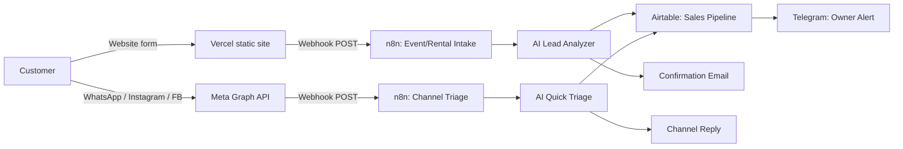
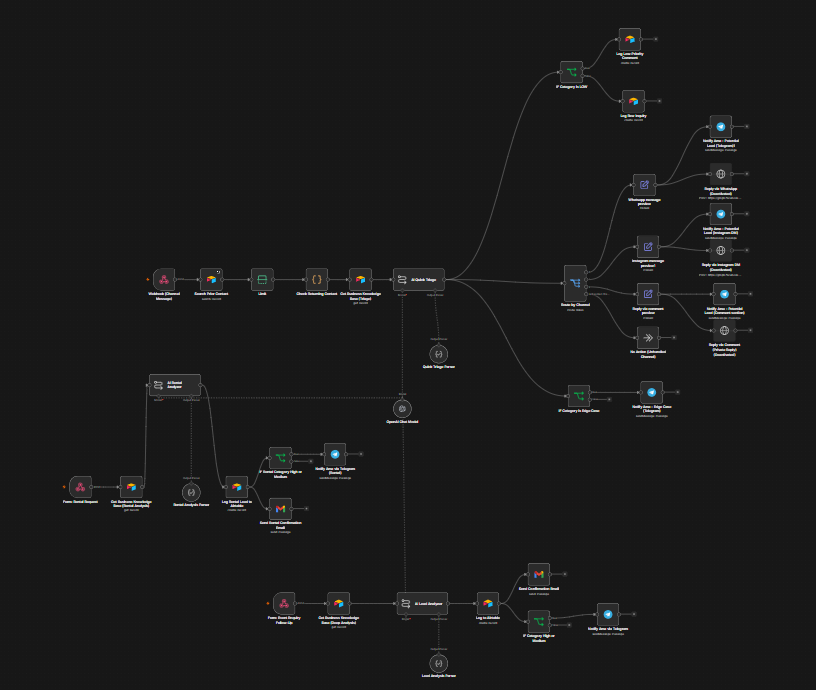

# The n8n Automation — Case Study

*Part of the [Ama Events Co. project](./README.md) — this file covers the backend automation in depth. See the root README for the site itself and the live demo link.*
📹 [Watch the video walkthrough] https://www.loom.com/share/e8d61b73e62b42fd969f259f792750d0
This isn't a "connect two apps together" demo. It's a working pipeline that was built, tested against real execution logs, and debugged the way a production system actually gets debugged — by finding what breaks and fixing it before a real customer hits it.

---

## The problem this solves

A small events business gets inquiries scattered across WhatsApp, Instagram, Facebook comments, and a website form — with one person (the owner) trying to triage all of it manually, with no way to tell a serious lead from a casual question, and no time to draft a personalized reply to every message.

This workflow does that triage automatically: it reads an inbound message, classifies it (urgency, category, budget signal), replies appropriately across whatever channel it came in on, logs it for the owner, and notifies her only when something actually needs her attention.

## Architecture

**Front end:** Static HTML/CSS/JS site, deployed on Vercel, two intake forms (full event booking, standalone rentals)

**Automation:** n8n (self-hosted), two entry points:
- Webhook intake from the site's own forms
- Webhook intake from Meta's Graph API (WhatsApp, Instagram DM, Instagram/Facebook comments)

**AI layer:** LLM-based triage classifies each inquiry (category, urgency, budget signal, red flags), generates a tailored reply, and tracks conversation history for returning contacts — including a genuine time-based greeting rule (skip re-greeting a customer who messaged within the last 3 hours; greet again if it's been longer)

**Data & notification:** Airtable for lead logging, Gmail for confirmation emails, Telegram for real-time owner alerts

### The actual workflow

41 nodes, four parallel paths from a single entry point: event booking, rental booking, and two channel-based inquiry routes (WhatsApp/Instagram/Facebook), each branching by lead category into its own logging, notification, and reply logic.

---

## Bugs found and fixed

This workflow went through an actual audit before being called "done" — not a happy-path demo. Some of what surfaced:

- **Webhook/Form Trigger mismatch.** The intake nodes were originally n8n Form Trigger nodes, which expect submissions through n8n's *own* hosted form — not an arbitrary JSON POST from an external site. Replaced with real Webhook nodes and remapped every downstream field reference to match the site's actual payload shape.
- **A silently broken reply channel.** The WhatsApp reply node had no message body configured at all — it would have fired empty requests to Meta's API with zero indication anything was wrong.
- **A placeholder mismatch that would have leaked to real customers.** The AI was instructed to output `[[FORM_LINK]]`, but two of three reply nodes were still checking for `{{FORM_LINK}}` — meaning a real customer could have received the literal placeholder text instead of a working link.
- **A returning-customer detection bug with no visible symptom until you looked for it.** The logic to recognize a returning contact was completely correct — but the timestamp it depended on was date-only (no time-of-day), making an hour-level "greet again after 3 hours" rule impossible until the fix switched to Airtable's full-precision `createdTime` metadata instead.
- **Cross-provider email deliverability.** Confirmation emails sent reliably to Gmail but silently failed — not even reaching spam — for 2 of 3 Outlook test addresses. Traced to sending transactional email from a personal Gmail account with no sender reputation, rather than a code bug. Documented as a known limitation with a scoped fix (see below).

## Known limitations — disclosed, not hidden

A workflow that hides its rough edges isn't ready for a real client. Here's what this one still needs before real-world launch:

- **Email deliverability:** Currently sends via a personal Gmail account, which Outlook/Microsoft's spam filtering treats inconsistently. Production fix: a proper transactional email service (SendGrid, Amazon SES, or Postmark all have generous free tiers at this volume) with the business's own domain authenticated via SPF/DKIM/DMARC.
- **Meta channel access:** WhatsApp/Instagram/Facebook reply nodes are built and correct, but inactive pending Meta Business verification — a real access requirement, not a technical gap.
- **Rate-limit resilience:** Outbound reply nodes have retry-with-backoff configured for transient failures, but a genuinely viral spike in comment volume would need proper queueing to handle gracefully — a scale problem worth revisiting if/when volume grows, not something to over-engineer for a first deployment.
- **Hosting:** Currently tunneled via ngrok for development/testing. Production path is Docker on a low-cost VPS (~$4–7/month) — deliberately sequenced *after* the workflow logic was fully proven, not before.

## Stack

n8n (self-hosted) · Claude/Groq (Llama 3.3) for AI triage · Airtable · Meta Graph API · Gmail · Telegram · Vercel · vanilla HTML/CSS/JS

## Status

Core logic complete and tested end-to-end (site → webhook → AI triage → Airtable → email → Telegram). Channel-based replies (WhatsApp/Instagram/Facebook) are built and verified via simulated payloads, pending Meta approval to go fully live.
